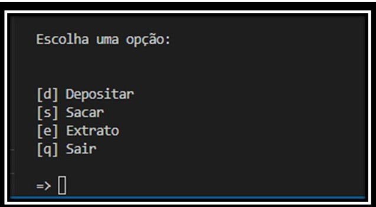

# Simple Banking System

Simple Banking System é um programa que simula um ambiente bancário simples com operações de depósitos, saques e extratos.

O Cliente poderá solicitar 3 saques diários com limite máximo de R$ 500,00 por saque.

## Menu de operações 

O programa exibir um menu onde o cliente pode escolher uma das opções como mostra a imagem

## Desafio realizado durante o Bootcamp Potência Tech powered by iFood | Ciência de Dados promovido por: 

<a href="https://www.dio.me">Digital Innovation one</a>